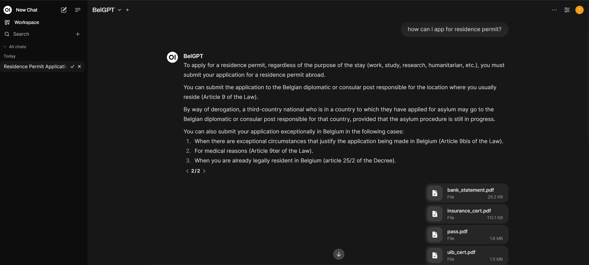
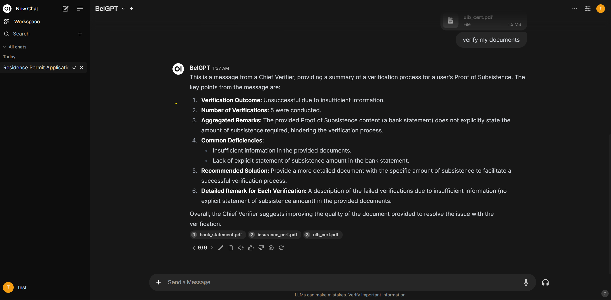

# **SwiftPermit:** Accelerating Residence Permit Renewal Through a Multi-Agent Framework

**SwiftPermit** is an AI-driven application that revolutionizes the residence permit renewal process by streamlining interactions between applicants and processing officers. With an intelligent agent supported by **Retrieval-Augmented Generation (RAG)** technology, applicants receive clear guidance on document requirements and can submit all necessary materials directly through the app. SwiftPermit's **multi-agent framework** validates submitted documents in the background, ensuring compliance and authenticity before passing qualified applications to officers. This setup allows officers to focus on final checks, reducing their workload and significantly accelerating processing times. Should any documents fail verification, feedback is sent directly to the applicant, minimizing unnecessary reviews for officers. **SwiftPermit enhances the application process for both applicants and administrators, making renewals more efficient and less time-consuming.**

**Tech Stack Used:** LLama3.2, AutoGen, MindsDB, OpenWebUI, FastAPI, ChromaDB, LangChain, MongoDB

Snippets of the UI:




The guide below provides step-by-step instructions to set up and run the project.

## Prerequisites

- Ensure that Docker and Docker Compose are installed on your system.

## Steps

1. **Start the Docker Compose services**  
   Run the following command to start the services defined in the `docker-compose.yml` file:
   ```bash
   docker-compose -f rag/docker-compose.yml up -d
   ```

2. **Access the Docker container**  
   Run the following command to open a bash shell in the `open-webui` container:
   ```bash
   docker exec -it open-webui bash
   ```

3. **Start the `chroma_serve` API**  
   Inside the container, run the following command to start `chroma_serve`:
   ```bash
   uvicorn chroma_serve:app --host 0.0.0.0 --port 8000 &
   ```
   _Note: Run this in the background using `&`._

4. **Access the Docker container again**  
   If you closed the previous session, open a new bash session in the `open-webui` container:
   ```bash
   docker exec -it open-webui bash
   ```

5. **Start the backend API**  
   Navigate to the backend directory and start the backend API:
   ```bash
   cd /backend/ && uvicorn backend.main:app --host 0.0.0.0 --port 8000 &
   ```
   _Note: Run this in the background using `&`._

6. **Access the OpenWeb UI**  
   Open your browser and go to [http://127.0.0.1:3000/workspace/functions](http://127.0.0.1:3000/workspace/functions).

7. **Add the `gpt.py` file**  
   - From the OpenWeb UI, upload the `gpt.py` file located in the `open-webui` directory.
   - Name the function `belgpt` and enable it.

8. **Select `belgpt` as the model**  
   Go to [http://127.0.0.1:3000](http://127.0.0.1:3000), and in the model selection, choose `belgpt`.

## Usage

After completing the setup, you can start interacting with the `belgpt` function through the interface.

---

### Enjoy experimenting with the `belgpt` model! 🎉
